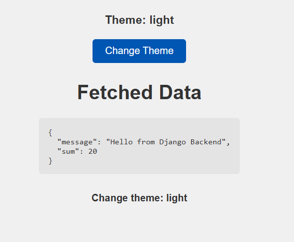

# React Theme & Data Fetch App

A simple React application demonstrating **theme switching**, **data fetching from an API**, and **error handling** using an `ErrorBoundary` component.

---

## Features

* **Theme Toggle:** Switch between light and dark mode using React Context.
* **API Data Fetching:** Fetch data from a backend API and display it in JSON format.
* **Error Handling:** Wrap components with `ErrorBoundary` to catch and display runtime errors.
* **React Context:** Share the theme across components using `ThemeContext`.

---

## Demo Screenshot

Add your screenshot(s) to the repository and reference them here. Example:

```markdown

```

> Replace `./screenshots/screenshot.png` with the path to your actual image file(s).

---

## Installation

1. **Clone the repository**

```bash
git clone https://github.com/saiheroforking/day-7.git
cd day-7
```

2. **Install dependencies**

```bash
npm install
```

3. **Start the development server**

```bash
npm start
```

Open `http://localhost:3000` in your browser.

> ⚠️ If your app depends on a backend API, make sure the backend is running and the `fetch` URL in `src/App.js` points to a reachable endpoint (not `127.0.0.1` after deploying to GitHub Pages).

---

## Deployment (GitHub Pages)

This project includes a `gh-pages` deployment setup in `package.json`. To deploy:

```bash
npm run build
npm run deploy
```

Your app will be available at: `https://<your-github-username>.github.io/<your-repo-name>`

**Important:** GitHub Pages is a static host — it cannot reach an API running on your local machine. If your app needs server data in production, deploy the backend to a public host (Render, Railway, Heroku, Vercel, etc.) and update the `fetch` URL accordingly.

---

## Scripts (from `package.json`)

* `npm start` — run the app in development mode
* `npm run build` — build the app for production
* `npm run deploy` — build + deploy to GitHub Pages (requires `gh-pages` devDependency)
* `npm test` — run tests

---

## File Structure

```
day-7/
├── public/
├── src/
│   ├── App.js
│   ├── App.css
│   ├── ChildComponent.js
│   ├── ErrorBoundary.js
│   └── index.js
├── package.json
└── README.md
```

---

## How it works (brief)

* `App.js`:

  * Manages theme state (`light` / `dark`) using `useState`.
  * Fetches API data using `useEffect` and saves it to state with `setData`.
  * Provides `ThemeContext` to child components.
* `ChildComponent.js`:

  * Consumes `ThemeContext` to adjust its styles based on the theme.
* `ErrorBoundary.js`:

  * Catches JavaScript errors in its child component tree and renders a fallback UI.

---

## Example: Updating the API URL

If you deploy your backend, update the fetch call in `src/App.js`:

```js
useEffect(() => {
  fetch("https://your-deployed-backend.com/api/python/")
    .then(res => res.json())
    .then(data => setData(data))
    .catch(error => console.error("Error fetching data:", error));
}, []);
```

If you don’t have a backend, you can mock data locally:

```js
useEffect(() => {
  const mock = { id: 1, name: "Demo" };
  setData(mock);
}, []);
```

---

## Screenshots (suggested structure)

Create a `screenshots/` folder in the repo and add:

* `screenshots/screenshot-light.png` — light-theme view
* `screenshots/screenshot-dark.png` — dark-theme view

Then reference them in this README.

---

## Contributing

Feel free to open issues or submit pull requests. If you add features, please update this README with instructions and screenshots.

---

## License

This project is open-source and free to use.

---

*Generated for the `React Theme & Data Fetch App` project.*
